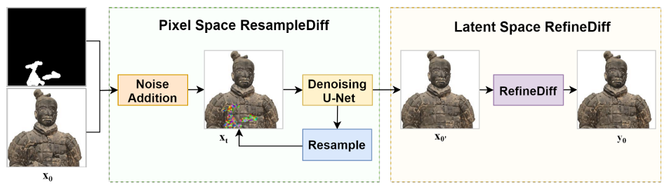
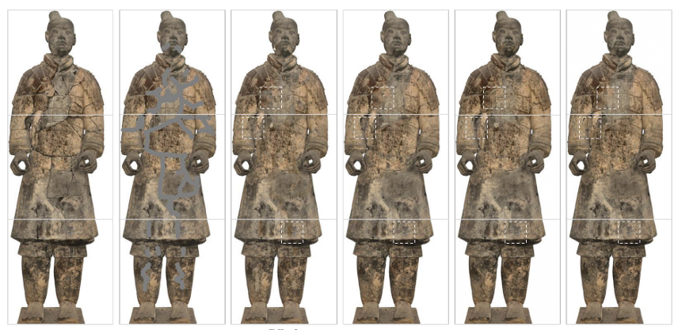

## TRRS-DM

Implementation of paper:TRRS-DM: Two-Stage Resampling and Residual Shifting for High-Fidelity Texture Inpainting of Terracotta Warriors Utilizing Diffusion Models

## Abstract

As a UNESCO World Heritage Site, the Terracotta Warriors face degradation from natural erosion. Traditional restoration is time-consuming, while computer-aided methods provide efficient digital solutions. We propose a Two-stage Resampling and Residual Shifting framework using Diffusion Models (TRRS-DM) for texture inpainting. The ResampleDiff module enhances details via perception-weighted learning and lightweight diffusion. The RefineDiff module refines results in latent space by removing noise. Experiments demonstrate that TRRS-DM achieves faster computation, surpasses existing methods in visual quality, and effectively restores damaged artifacts. This approach advances digital heritage restoration and providing scalable supports for archaeological conservation.

## Method

## Result

